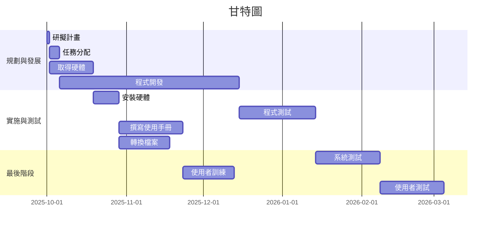

### PERT/CPM 圖


digraph {
	node[shape=record];
	rankdir="LR";
    no1 [label = "取得授權 | 編號:1 | 開始:第1天 | 結束:第10天 | 需時:10天"]
    no2 [label = "聘僱分析師 | 編號:2 | 開始:第11天 | 結束:40 | 需時:30天"]
    no1->no2
    no3 [label = "規劃訓練 | 編號:3 | 開始:第41天 | 結束:第45天 | 需時:5天"]
    no4 [label = "安排後勤 | 編號:4 | 開始:第41天 | 結束:第65天 | 需時:25天"]
    {rank=same;no3 no4}
    no2->no3
    no2->no4
    no5 [label = "宣告訓練 | 編號:5 | 開始:第66天 | 結束:第95天 | 需時:30天"]
    no3->no5
    no4->no5
}

``` mermaid
digraph {
	no1[研擬計畫 | 編號:1 | 開始:第1天 | 結束:第1天 | 需時:1天]
	no2[任務分配 | 編號:2 | 開始:第2天 | 結束:第5天 | 需時:4天]
	no3[取得硬體 | 編號:3 | 開始:第2天 | 結束:第18天 | 需時:17天]
	no4[程式開發 | 編號:4 | 開始:第6天 | 結束:第75天 | 需時:70天]
	no5[安裝硬體 | 編號:5 | 開始:第19天 | 結束:第28天 | 需時:10天]
	no6[程式測試 | 編號:6 | 開始:第76天 | 結束:第105天 | 需時:30天]
	no7[撰寫使用手冊 | 編號:7 | 開始:第29天 | 結束:第53天 | 需時:25天]
	no8[轉換檔案 | 編號:8 | 開始:第29天 | 結束:第48天 | 需時:20天]
	no9[系統測試 | 編號:9 | 開始:第106天 | 結束:第130天 | 需時:25天]
	no10[使用者訓練 | 編號:10 | 開始:第54天 | 結束:第73天 | 需時:20天]
	no11[使用者測試 | 編號:11 | 開始:第131天 | 結束:第155天 | 需時:25天]

	no1 --> no2
	no1 --> no3
	no2 --> no4
	no3 --> no5
	no4 --> no6
	no5 --> no7
	no5 --> no8
	no6 --> no9
	no7 --> no10
	no8 --> no10
	no9 --> no11
	no10 --> no11
}
```



### 關鍵路徑
**1 > 2 > 4 > 6 > 9 > 11**

*在專案管理中，專案網路圖上耗時最長的活動序列，決定了專案的總工期。*
