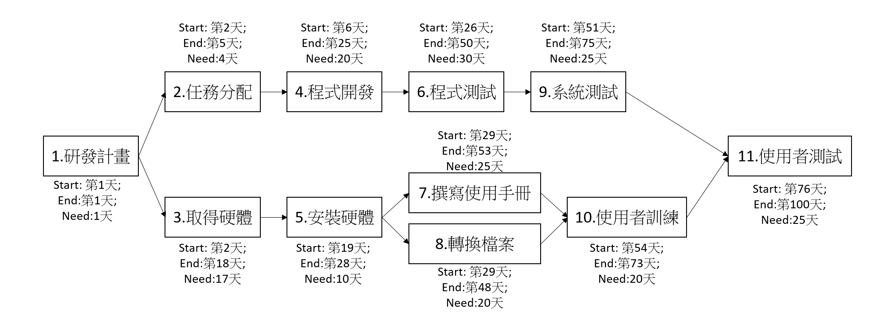

### PERT/CPM 圖

### 甘特圖

```mermaid
gantt
    title Project Timeline

    section 規劃與發展
    研擬計畫        : Task1, 2025-10-01, 1d
    任務分配        : Task2, after Task1, 4d
    取得硬體        : Task3, after Task1, 17d
    程式開發        : Task4, after Task2, 70d
    section 實施與測試
    安裝硬體        : Task5, after Task3, 10d
    程式測試        : Task6, after Task4, 30d
    撰寫使用手冊    : Task7, after Task5, 25d
    轉換檔案        : Task8, after Task5, 20d
    section 最後階段
    系統測試        : Task9, after Task6, 25d
    使用者訓練      : Task10, after Task7, 20d
    使用者測試      : Task11, after Task9, 25d
```

