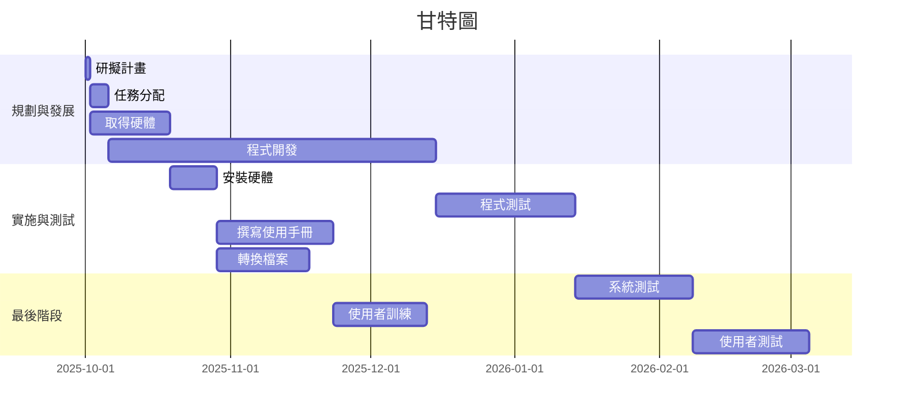

### PERT/CPM 圖


``` mermaid
graph TD
    subgraph 專案時程圖 (Project Schedule Diagram)
        A[1. 研擬計畫 (1天)] --> B(2. 任務分配 (4天))
        A --> C(3. 取得硬體 (17天))

        B --> D(4. 程式開發 (70天))

        C --> E(5. 安裝硬體 (10天))

        D --> F(6. 程式測試 (30天))

        E --> G(7. 撰寫使用手冊 (25天))
        E --> H(8. 轉換檔案 (20天))

        F --> I(9. 系統測試 (25天))

        G & H --> J(10. 使用者訓練 (20天))

        I & J --> K(11. 使用者測試 (25天))
    end
```



### 關鍵路徑
**1 > 2 > 4 > 6 > 9 > 11**

*在專案管理中，專案網路圖上耗時最長的活動序列，決定了專案的總工期。*
